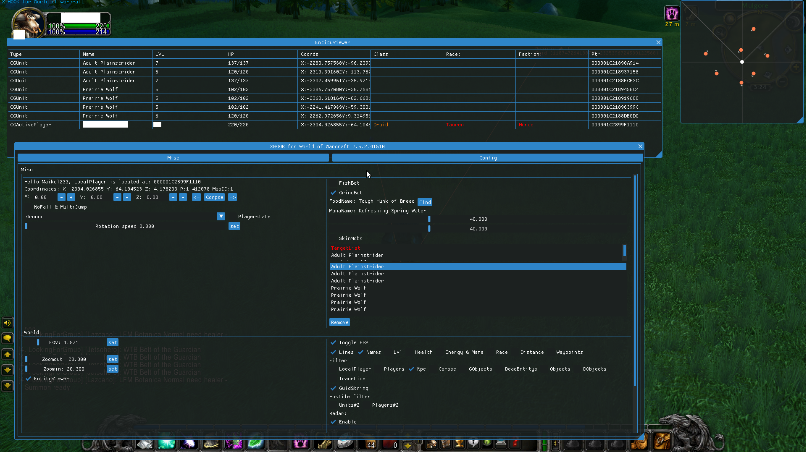
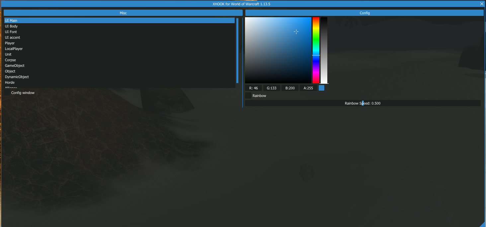
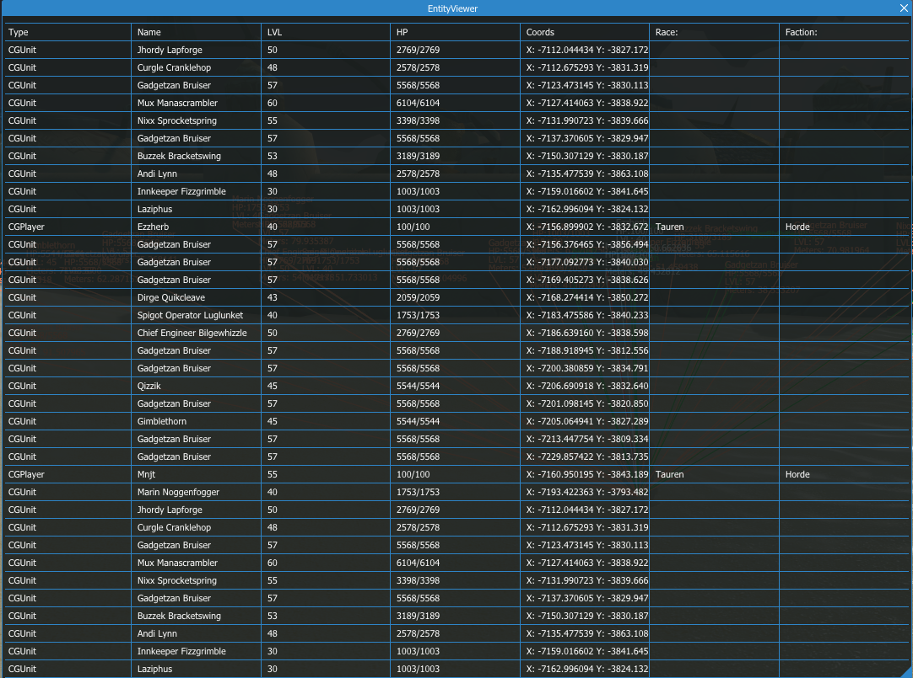

# xhook wowclassic TBC
World of warcraft TBC classic multihack 
Source code supported patch: 2.5.4.44883
Prebuild .DLL supported patch: 2.5.4.44883 

How to build the .DLL:
Open C++, Build DebugX64 version, Open the game go to settings and set your directx version on dx11. Download a injector and inject.

Does not contain any anti Warden code use at your own risk!







Dont pm me if you cant build it on yourself and dont know how to update it...


https://www.youtube.com/watch?v=NHlHjc5f8SE&t=1s&ab_channel=TeamGalixte

https://www.youtube.com/watch?v=0yB7eiAlFn4&ab_channel=TeamGalixte

https://www.youtube.com/watch?v=RRFxpNt2zvc&ab_channel=TeamGalixte

Detour https://github.com/Jnnshschl/AmeisenNavigation

Hadesmem https://github.com/namreeb/hadesmem.git

Microsoft DirectX SDK (June 2010) https://www.microsoft.com/en-us/download/confirmation.aspx?id=6812 
S1023 during install SDK https://learn.microsoft.com/en-us/troubleshoot/windows/win32/s1023-error-when-you-install-directx-sdk
RUN THIS UNDER ADMIN
```
MsiExec.exe /passive /X{F0C3E5D1-1ADE-321E-8167-68EF0DE699A5}

MsiExec.exe /passive /X{1D8E6291-B0D5-35EC-8441-6616F567A0F7}
```

boost1.68 https://sourceforge.net/projects/boost/files/boost-binaries/1.68.0/